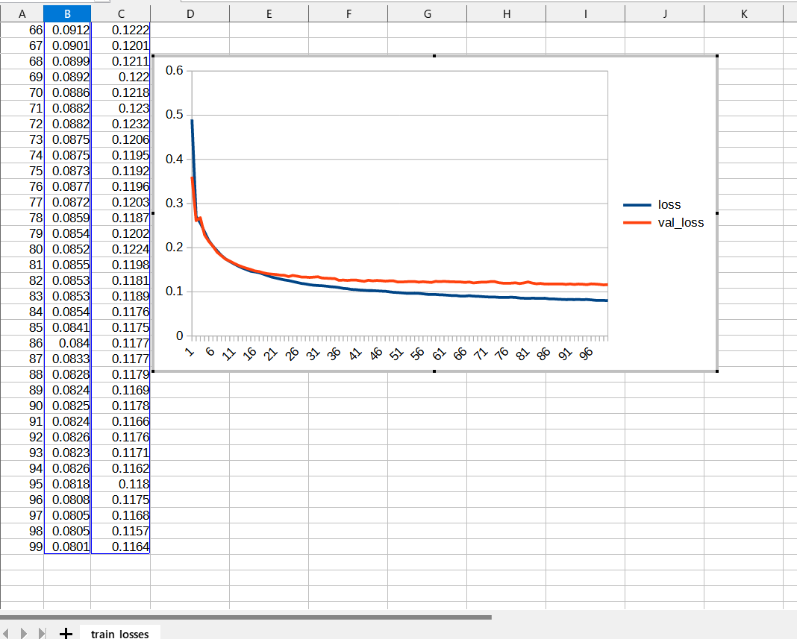
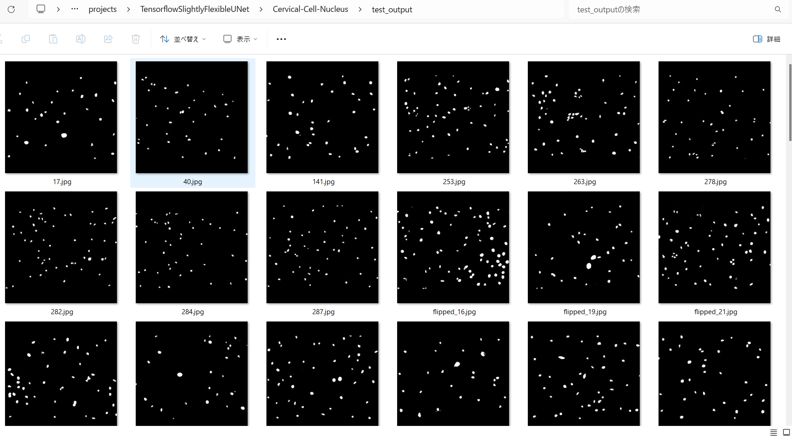

<h2>Tensorflow-Image-Segmentation-Cervical-Cell-Nucleus (2024/02/02)</h2>

This is an experimental Image Segmentation project for Cervical-Cell-Nucleus based on
the <a href="https://github.com/sarah-antillia/Tensorflow-Image-Segmentation-API">Tensorflow-Image-Segmentation-API</a>.
 
As a first trial, we use the simple UNet Model 
<a href="./src/TensorflowUNet.py">TensorflowSlightlyFlexibleUNet</a> for this Cervical-Cell-Nucleus Segmentation. 
As shown in <a href="https://github.com/sarah-antillia/Tensorflow-Image-Segmentation-API">Tensorflow-Image-Segmentation-API</a>.
you may try other Tensorflow UNet Models: 
<pre>
<li><a href="./src/TensorflowSwinUNet.py">TensorflowSwinUNet.py</a></li>
<li><a href="./src/TensorflowMultiResUNet.py">TensorflowMultiResUNet.py</a></li>
<li><a href="./src/TensorflowAttentionUNet.py">TensorflowAttentionUNet.py</a></li>
<li><a href="./src/TensorflowEfficientUNet.py">TensorflowEfficientUNet.py</a></li>
<li><a href="./src/TensorflowUNet3Plus.py">TensorflowUNet3Plus.py</a></li>
 
</pre>

<h3>1. Dataset Citatioin</h3>

<b>Data for: Binary Tree-like Network with Two-path Fusion Attention Feature for Cervical Cell Nucleus Segmentation</b> 
<pre>
Published: 18 April 2019 Version 1

https://data.mendeley.com/datasets/jks43dkjj7/1

DOI:
10.17632/jks43dkjj7.1

Contributor:
Jianwei Zhang

Description
The images are based on Liquid-Based Cytology test from the pathology departments of a Chinese hospital 
and a biomedical device company. Under the guidance of a professional pathologist, we choose qualified 
images in numerous LCT cervical images. The dataset contains 104 images with size  and each image has 
a ground truth that has been manually segmented by a professional pathologist.

Licence
CC BY 4.0
</pre>

<h3>
<a id="2">
2 Cervial-Cell-Nucleus ImageMask Dataset
</a>
</h3>
 If you would like to train this Cervical-Cell-Nucleus Segmentation model by yourself,
 please download the  
 augmented dataset of image-size 512x512 from the google drive 
<a href="https://drive.google.com/file/d/1hyxctv-trt36A72YXHGklo5GEUZOf0jR/view?usp=sharing">
Cervial-Cell-Nucleus-ImageMask-Dataset.zip.</a>
<!--
Please see also the <a href="https://github.com/atlan-antillia/Cervical-Cell-Nucleus-Image-Dataset">Cervical-Cell-Nucleus-Image-Dataset</a>. 
-->
Please expand the downloaded ImageMaskDataset and place them under <b>./dataset</b> folder to be

<pre>
./dataset
└─Cervial-Cell-Nucleus
    ├─test
    │  ├─images
    │  └─masks
    ├─train
    │  ├─images
    │  └─masks
    └─valid
        ├─images
        └─masks
</pre>
Please run the following bat file to count the number of images in this dataset. 
<pre>
./dataset_stat.bat
</pre> 
, which generates the following <b>Cervical-Cell-Nucleus_Statistics.png</b> file. 
<b>Cervical-Cell-Nucleus Dataset Statistics</b> 
 

<h3>
<a id="3">
3 TensorflowSlightlyFlexibleUNet
</a>
</h3>
This <a href="./src/TensorflowUNet.py">TensorflowUNet</a> model is slightly flexibly customizable by a configuration file. 
For example, <b>TensorflowSlightlyFlexibleUNet/Cervical-Cell-Nucleus</b> model can be customizable
by using <a href="./projects/TensorflowSlightlyFlexibleUNet/Cervical-Cell-Nucleus/train_eval_infer.config">
train_eval_infer.config.</a>
<pre>
; train_eval_infer.config
; 2024/02/02 (C) antillia.com

[model]
model          = "TensorflowUNet"
;base_kernels   = (5,5)
dilation       = (2,2)
image_width    = 512
image_height   = 512
image_channels = 3
num_classes    = 1
base_filters   = 16
num_layers     = 7
dropout_rate   = 0.08
learning_rate  = 0.0001

loss           = "bce_iou_loss"
;loss           = "binary_crossentropy"
metrics        = ["binary_accuracy"]
show_summary   = False

[train]
epochs        = 100
batch_size    = 4
patience      = 10
metrics       = ["binary_accuracy", "val_binary_accuracy"]

model_dir     = "./models"
eval_dir      = "./eval"

image_datapath = "../../../dataset/Cervical-Cell-Nucleus/train/images/"
mask_datapath  = "../../../dataset/Cervical-Cell-Nucleus/train/masks/"

[eval]
image_datapath = "../../../dataset/Cervical-Cell-Nucleus/valid/images/"
mask_datapath  = "../../../dataset/Cervical-Cell-Nucleus/valid/masks/"

[infer] 
images_dir    = "../../../dataset/Cervical-Cell-Nucleus/test/images/"
output_dir    = "./test_output"
merged_dir    = "./test_output_merged"
green_mask    = True

[mask]
blur      = False
binarize  = True
threshold = 128
</pre>

<h3>
3.1 Training
</h3>
Please move to a <b>./projects/TensorflowSlightlyFlexibleUNet/Cervical-Cell-Nucleus</b> folder, 
and run the following bat file to train TensorflowUNet model for Cervical-Cell-Nucleus. 
<pre>
./1.train.bat
</pre>
<pre>
python ../../../src/TensorflowUNetTrainer.py ./train_eval_infer.config
</pre>
Train console output: 
 
 

Train metrics: 
 
 
Train losses: 
 
 
<h3>
3.2 Evaluation
</h3>
Please move to a <b>./projects/TensorflowSlightlyFlexibleUNet/Cervical-Cell-Nucleus</b> folder, 
and run the following bat file to evaluate TensorflowUNet model for Cervical-Cell-Nucleus. 
<pre>
./2.evaluate.bat
</pre>
<pre>
python ../../../src/TensorflowUNetEvaluator.py ./train_eval_infer.config
</pre>
Evaluation console output: 
 
As shown above, the accuracy 0.9972 for the test dataset is very high.

<h2>
3.3 Inference
</h2>
Please move to a <b>./projects/TensorflowSlightlyFlexibleUNet/Cervical-Cell-Nucleus</b> folder 
,and run the following bat file to infer segmentation regions for images by the Trained-TensorflowUNet model for Cervical-Cell-Nucleus. 
<pre>
./3.infer.bat
</pre>
<pre>
python ../../../src/TensorflowUNetInferencer.py ./train_eval_infer.config
</pre>
Sample test images 
 
Sample test mask 
 

 
Inferred test masks 
 
 
Merged test images and inferred masks  
  

Enlarged samples 
<table>
<tr>
<td>test/images/18.jpg 

</td>
<td>Inferred merged/18.jpg 

</td> 
</tr>

<tr>
<td>test/images/294.jpg 

</td>
<td>Inferred merged/294.jpg 

</td> 
</tr>

<tr><td>test/images/flipped_12.jpg 

</td>
<td>Inferred merged/flipped_12.jpg 

</td> 
</tr>

<tr>
<td>test/images/mirrored_303.jpg 

</td>
<td>
Inferred merged/mirrored_303.jpg 

</td> 
</tr>

<tr>
<td>test/images/rotated_180_287.jpg 

</td>
<td>Inferred merged/rotated_180_287.jpg 

</td> 
</tr>
</table>

<h3>
References
</h3>
<b>1. Cervical cell’s nucleus segmentation through an improved UNet architecture</b> 
Assad Rasheed,Syed Hamad Shirazi ,Arif Iqbal Umar,Muhammad Shahzad ,Waqas Yousaf,Zakir Khan 
Published: October 3, 2023 
https://doi.org/10.1371/journal.pone.0283568 
<pre>
https://journals.plos.org/plosone/article?id=10.1371/journal.pone.0283568
</pre>

<b>2.An Improved Cervical Cell Segmentation Method Based on Deep Convolutional Network</b> 
Xueli Hao,Lili Pei,Wei Li,Ying Liu,and Hao Shen1 
Published: 10 Mar 2022 
<pre>
https://www.hindawi.com/journals/mpe/2022/7383573/
</pre>

